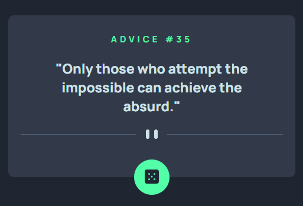

<h1 align="center"> Advice Generator App </h1> 

A project using the Advice API

  
  <a href="#-screenshots">Screenshots</a>&nbsp;&nbsp;&nbsp;|&nbsp;&nbsp;&nbsp;
  <a href="#-technologies">Technologies</a>&nbsp;&nbsp;&nbsp;|&nbsp;&nbsp;&nbsp;
  <a href="#-features">Features</a>&nbsp;&nbsp;&nbsp;|&nbsp;&nbsp;&nbsp;
  <a href="#-project">Project</a>&nbsp;&nbsp;&nbsp;|&nbsp;&nbsp;&nbsp;
  <a href="#-license">License</a>&nbsp;&nbsp;&nbsp;|&nbsp;&nbsp;&nbsp; 
  <a href="#-contributing">Contributing</a>&nbsp;&nbsp;&nbsp;|&nbsp;&nbsp;&nbsp;  
  <a href="#-support">Support</a> 
  

  

 

## 📸 Screenshots

  

 

## 🛠 Technologies

- HTML
- CSS
- JavaScript;
- Node;
- JSON;
- API
- Git e GitHub.

 

## ✨ Features

- [x] Responsive design for seamless usage on various devices.
- [x] Click event functionality to generate new advice.
- [x] Integration with the Advice API to fetch random advice.

 

## 💻 Project

- The website was created to practice JavaScript, Node, JSON and API skills.

 

## 📜 License

* This project is licensed under the [MIT License](https://choosealicense.com/licenses/mit/)

 

## 🫱🏻‍🫲🏻 Contributing

 Contributions, issues, and feature requests are welcome! Please, feel free to do it! 😉 

 

## 🌟 Support

 If you like this project, please give it a star ⭐ and share it with others! 😄 

